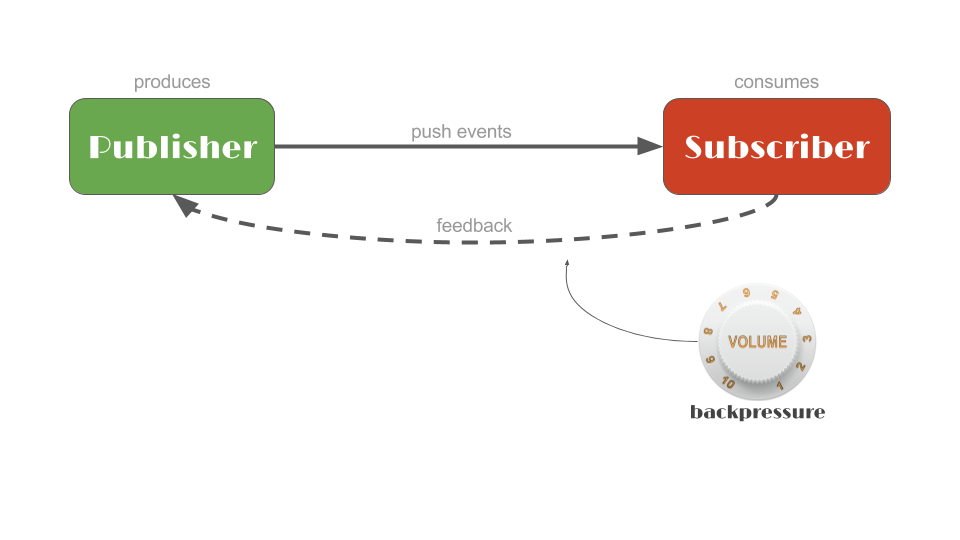

翻译自：[https://tech.io/playgrounds/929/reactive-programming-with-reactor-3/Request](https://tech.io/playgrounds/929/reactive-programming-with-reactor-3/Request)

#Request
***
##Description
***
Remember this diagram?


There's one aspect to it that we didn't cover: the volume control. In Reactive 
Streams terms this is called `backpressure`. It is a feedback mechanism that 
allows a `Subscriber` to signal to its `Publisher` how much data it is prepared 
to process, limiting the rate at which the `Publisher` produces data.
```markdown
有一个方面我们没有涉及：容量控制。在反应流术语中，这称为backpressure（背压）。这是一种反馈机制，
允许订阅者向其发布者发出信号，告知其准备处理多少数据，从而限制发布者生成数据的速率。
```

This control of the demand is done at the `Subscription` level: a `Subscription` is 
created for each `subscribe()` call and it can be manipulated to either `cancel()` 
the flow of data or tune demand with `request(long)`.
```markdown
这种对需求的控制是在订阅级别上完成的：为每个subscribe()调用创建一个订阅，可以对其进行操作，
以cancel()数据流或使用request(long)调整需求。
```

Making a `request(Long.MAX_VALUE)` means an **unbounded demand**, so the 
`Publisher` will emit data at its fastest pace.
```markdown
request(Long.MAX_VALUE)意味着无限的需求，因此发布者将以最快的速度发布数据。
```

##Practice
***
The demand can be tuned in the `StepVerifier` as well, by using the relevant 
parameter to `create` and `withVirtualTime` for the initial request, then 
chaining in `thenRequest(long)` in your expectations for further requests.
```markdown
也可以在StepVerifier中调整需求，通过使用相关参数来create和withVirtualTime 初始请求，
然后将thenRequest(long)链接到您对进一步请求的期望中。
```

In this first example, create a `StepVerifier` that produces an initial 
unbounded demand and verifies 4 values to be received, before completion. 
This is equivalent to the way you've been using StepVerifier so far.
```markdown
在第一个示例中，创建一个StepVerifier，生成初始无界需求，并在完成之前验证要接收的4个值。
这相当于您目前使用StepVerifier的方式。

    // Create a StepVerifier that initially requests all values and expect 4 values to be received
    StepVerifier requestAllExpectFour(Flux<User> flux) {
        return StepVerifier
                .create(flux)
                .thenRequest(Long.MAX_VALUE)
                .expectNextCount(4)
                .expectComplete();
    }
```

Next we will request values one by one: for that you need an initial request, 
but also a second single request after you've received and asserted the first element.
```markdown
接下来，我们将逐个请求值：为此，您需要一个初始请求，但也需要在收到并断言第一个元素后 做第二个单独地请求。
```

Without more request, the source will never complete unless you cancel it. 
This can be done instead of the terminal expectations by using `.thenCancel()`. 
If you want to also ensure no incoming signal is received over a `Duration` you 
can instead use `.expectTimeout(Duration)`.
```markdown
如果没有更多的请求，源将永远无法完成，除非您取消它。这可以通过使用.thenCancel()来代替终端期望。
如果您还想确保在一段时间内没有接收到任何传入信号，则可以使用.expectTimeout(Duration)。

    // Create a StepVerifier that initially requests 1 value and expects User.SKYLER then requests another value and expects User.JESSE then stops verifying by cancelling the source
    StepVerifier requestOneExpectSkylerThenRequestOneExpectJesse(Flux<User> flux) {
        return StepVerifier
                .create(flux)
                .thenRequest(1).expectNext(User.SKYLER)
                .thenRequest(1).expectNext(User.JESSE)
                .thenCancel();
    }
```

##A note on debugging
***
How to check that the previous sequence was requested one by one, and that a 
cancellation happened?
```markdown
如何检查前一个序列是否被逐个请求，以及是否发生了取消？
```

It's important to be able to debug reactive APIs, so in the next example we will 
make use of the `log` operator to know exactly what happens in terms of signals 
and events.
```markdown
能够调试反应式API很重要，因此在下一个示例中，我们将使用日志运算符来准确了解信号和事件的情况。
```

Use the `repository` to get a `Flux` of **all** users, then apply a log to it. 
Observe in the console below how the underlying test requests it, and the other 
events like subscribe, onNext...
```markdown
使用repository获取所有用户的Flux，然后对其应用日志。在下面的控制台中观察底层测试如何请求它，
以及其他事件，如subscribe、onNext等

    // Return a Flux with all users stored in the repository that prints automatically logs for all Reactive Streams signals
    Flux<User> fluxWithLog() {
        return repository.findAll().log();
    }
```

运行日志如下：
```markdown
2022-07-25 09:46:53 [main] INFO  reactor.Flux.Zip.1 - onSubscribe(FluxZip.ZipCoordinator)
2022-07-25 09:46:53 [main] INFO  reactor.Flux.Zip.1 - request(1)
2022-07-25 09:46:53 [parallel-1] INFO  reactor.Flux.Zip.1 - onNext(Person{username='swhite', firstname='Skyler', lastname='White'})
2022-07-25 09:46:53 [parallel-1] INFO  reactor.Flux.Zip.1 - request(1)
2022-07-25 09:46:54 [parallel-1] INFO  reactor.Flux.Zip.1 - onNext(Person{username='jpinkman', firstname='Jesse', lastname='Pinkman'})
2022-07-25 09:46:54 [parallel-1] INFO  reactor.Flux.Zip.1 - request(2)
2022-07-25 09:46:54 [parallel-1] INFO  reactor.Flux.Zip.1 - onNext(Person{username='wwhite', firstname='Walter', lastname='White'})
2022-07-25 09:46:54 [parallel-1] INFO  reactor.Flux.Zip.1 - onNext(Person{username='sgoodman', firstname='Saul', lastname='Goodman'})
2022-07-25 09:46:54 [parallel-1] INFO  reactor.Flux.Zip.1 - onComplete()
```

If you want to perform custom actions without really modifying the elements 
in the sequence, you can use the "side effect" methods that start with `do`/`doOn`.
```markdown
如果您想在不修改序列中元素的情况下执行自定义操作，可以使用以do/doOn开头的“副作用”方法。
```

For example, if you want to print "Requested" each time the operator receives 
a request, use `doOnRequest`. If you want to print "Starting" first, upon 
subscription before any signal has been received, use `doFirst`, etc.
```markdown
例如，如果您想在运算符每次收到请求时打印"Requested"，请使用doOnRequest。
如果您想先打印"Starting"，在收到任何信号之前订阅时，请使用doFirst等。
```

Each `doOn` method takes a relevant callback representing the custom action for 
the corresponding event.
```markdown
每个doOn方法接受一个相关回调，表示相应事件的自定义操作。
```

Note that you should not block or invoke operations with latency in these callbacks 
(which is also true of other operator callbacks like `map`): it's more for quick 
operations.
```markdown
注意，您不应该在这些回调中阻塞或调用具有延迟的操作（对于其他操作符回调，如map也是如此）：它更适合快速操作。

    // Return a Flux with all users stored in the repository that prints "Starring:" at first, "firstname lastname" for all values and "The end!" on complete
    Flux<User> fluxWithDoOnPrintln() {
        return repository
                .findAll()
                .doFirst(()->System.out.println("Starring:"))
                .doOnNext(user -> System.out.println(user.getFirstname()+" "+user.getLastname()))
                .doOnComplete(()->System.out.println("The end!"));
    }
```